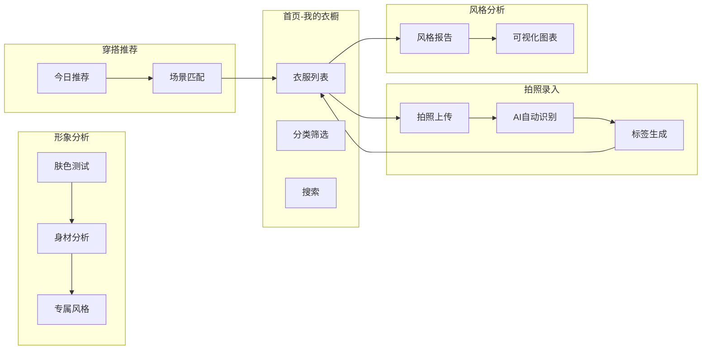

产品名称: 穿搭密码
Slogan: 了解自己，从穿搭开始
工具形态: 移动 App

【用户画像】

林小暖，26岁，互联网公司运营专员，每天早上出门前总是站在衣柜前发呆——明明衣服不少，却总觉得没衣服穿。她想要了解自己的穿衣风格，找到最适合自己的搭配，但每次买衣服都靠感觉入手，穿出来却总觉得哪里不对。她的核心痛点是：不知道自己适合什么风格，买衣服容易踩雷，出门搭配花费大量时间。

【场景故事】

场景一：周末下午，林小暖整理衣橱，拍了十几张照片上传到 App。AI 自动识别出每件衣服的类别、颜色和风格。晚上她打开「风格报告」，看到自己偏好人淡如菊的莫兰迪色系、喜欢简约舒适的款式，于是对自己有了新的了解。下次买衣服时，她终于有了参考标准。

场景二：周一早上赶着出门，林小暖在 App 首页点击「今日穿搭」，AI 根据天气、她的风格偏好和现有衣物，推荐了三套搭配方案。她选了一套直接出门，不再纠结。

【核心功能 MVP】

- 智能衣橱录入：拍照自动识别衣服类别、颜色、风格标签，支持手动补充信息
- 风格分析报告：基于衣橱数据，分析用户的穿衣偏好、色系倾向、风格关键词，生成可视化报告
- 深度形象分析：AI 分析用户肤色、身材特点，给出专属风格定位和穿搭建议
- 每日穿搭推荐：根据天气、场景和用户风格偏好，智能推荐当日穿搭方案

【交互流程】

- 打开 App，进入首页「我的衣橱」查看所有衣服
- 点击「+」拍照上传新衣服，AI 自动识别并归类
- 进入「风格报告」查看自己的穿衣风格分析
- 进入「形象分析」完成肤色、身材测试，获取专属风格建议
- 在「每日推荐」获取 AI 穿搭建议，快速选择出门搭配

【Mermaid 流程图】

【API 接入方案（待确认）】

### 会调用的 API

- **MiniMax LLM（`/v1/chat/completions`）**：用于风格分析报告生成、每日穿搭推荐（Prompt 驱动）；Bearer Token 鉴权，Key 存服务端 `.env.local`；降级：风格报告返回静态兜底模板，推荐返回空列表+友好提示
- **衣物图像识别 API**：用于拍照录入时自动识别衣服类别/颜色/风格；优先尝试用 MiniMax LLM 读图（Base64 传入），若不支持则接入第三方图像识别服务；降级：识别失败返回空标签，用户手动填写
- **天气 API（wttr.in 或 Open-Meteo）**：用于每日穿搭的天气数据；免费无需 Key，可前端直接调用；降级：请求失败默认"晴，20-25°C"

### 暂不接入的 API

- **MiniMax `image-01`（文生图）**：PRD 无图生图需求；风格报告是文本分析，不是生成图片
- **MiniMax 视频/音乐生成**：与 MVP 核心场景无关

### 关键约束

- Next.js 移动端 App，所有私密 API Key 必须放在服务端（环境变量 `.env.local`），客户端通过 API Route 间接调用
- API 调用须含日志：入口路由、方法名、Prompt 长度（脱敏）、响应长度、耗时、错误类型
- 形象分析的肤色/身材数据为敏感生物特征，仅本地加密存储，不上传第三方